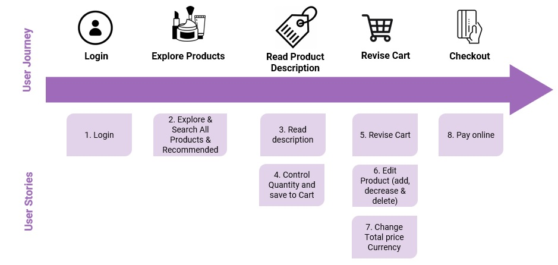

# Rose Cosmetics Store App-Team 5

## ✧ Name of the project
### Rose Cosmetics Store App 💄 ###

## ✧ Links
- App Live link: [Here](#)
- App Repo Link on Github:[Here](#)
- Figma Prototype link: [Here](https://www.figma.com/proto/D6wEIVgBJjjTW7Y1OF3GEw/cosmetics?node-id=13%3A56&scaling=scale-down&page-id=0%3A1&starting-point-node-id=13%3A56)
- Figma Design link: [Here](https://www.figma.com/file/D6wEIVgBJjjTW7Y1OF3GEw/cosmetics?node-id=0%3A1)
- API documentation
  - API (1): [Makeup Products](https://makeup-api.herokuapp.com/)
  - API (2): [Skin Care](https://rapidapi.com/apidojo/api/sephora)
  - API (3): [Exchange Rates](https://www.exchangerate-api.com/)

## ✧The Problem
Rose noticed decreasing customer number to her small store in a small village in northern of London, when she asked her loyal customer about the reason, they expressed that it is easier for them to explore products online. Rose realized it is a matter of survival for her small business to has an online store app.

## ✧Customer Persona
- Lives in UK.
- Females from 18 - 30.
- Like to follow fashion.
- Most customers are using mobile for shopping.

## ✧The Solution
GSG-Team 5 come up with creating a ***Rose Cosmetics Store App 💄***, This app provides for the customers an attractive journey, they login and explore products and easily revise the cart and checkout online.

## ✧ Product Main Features:
* User-friendly.
* Attractive comfortable theme.
* Local Storage Supported.
* Mobile First: Iphone x. 

## ✧User Journey
 <br>
1. The customer login to the app.
2. The customer explore products or search them.
3. The customer can read the product description and the required quantity to the cart.
4. The customer can revise the cart.
5. The customer checkout and pay the products.


## ✧User Stories
 <br>
After different meeting with the client, the team developed the following user stories: <br>
1- As a `Customer`, I want ***Login using my name*** so that ***I find my saved products in the cart***. <br>
2- As a `Customer`, I want ***Explore & search products under Makeup section*** so that ***I reached my wanted products***.<br>
3- As a `Customer`, I want ***Explore & search products under Skin Care section*** so that ***I reached my wanted products***.<br>
4- As a `Customer`, I want ***Explore & search All Store products*** so that ***I reached my wanted products***.<br>
5- As a `Customer`, I want ***Explore recommended products*** so that ***I may reach a good recommended product***.<br>
6- As a `Customer`, I want ***read more description about selected product*** so that ***I get more info to decide to buy the product***.<br>
7- As a `Customer`, I want ***Control quantity of the product and save to the cart*** so that ***I can save my selections without repeating the process***.<br>
8- As a `Customer`, I want ***revise my cart*** so that ***I finalize my order before checkout***.<br>
9- As a `Customer`, I want ***Edit Products in my cart (add Q, decrease Q or delete)*** so that ***I finalize my order before checkout***.<br>
10- As a `Customer`, I want ***Toggle between the three currency GBP/USD/EUR*** so that ***I see the total cart price in my perffered currency***.<br>
11- As a `Customer`, I want ***To pay online*** so that ***I complete checkout process***.<br>


**Other user stories were added to the backlog, and will implemented upon the availability of project time.** <br>
1- As a `Customer`, I want ***toggle between dark/normal mode*** so that ***I get my eye comfortable***. <br>

## ✧The wireframes ( The initial screens)
  <br>
Let people know your planning process and the initial screens that you agreed on it then upload or add your sketch you can use balsamiq wireframe


## ✧The Users Interface (The Final screens)
 <br>
based on the initial wireframe, The team discussed different themes and color systems, then worked on the final design. <br>
Figma Prototype link: [Here](https://www.figma.com/proto/D6wEIVgBJjjTW7Y1OF3GEw/cosmetics?node-id=13%3A56&scaling=scale-down&page-id=0%3A1&starting-point-node-id=13%3A56)

## ✧Project Github Management
 <br>
The team held a work shop and subdivided the user stories into smaller tasks to work on and ranked the priority.


## ✧How to install the project to run it locally.
on Github terminal/bash

```shell
git clone https://github.com/GSG-FC03/Cosmetics-Store.git
cd Cosmetics-Store
go live server
```

## ✧Technology
- HTML ➙ to build the structure of the pages 
- CSS ➙ to style the application
- JavaScript|DOM Manipulations ➙ To create interaction between the page and the user and track and process customer buying journey.
- API ➙ to import/search products data.
- LocalStorage ➙ to store customers products selections.

## ✧Team members
1. [Mohammad Hellis](https://github.com/mo7amedehab97)
2. [Eman Hassouna](https://github.com/EmanHass)
3. [Abdulrahman Kallusa](https://github.com/abdulrahman-2020)
4. [Mutasem Mansour](https://github.com/MMansour87).

## ✧Mentors
All deep thanks for the the valuable efforts of the mentors:
- [Sara](https://github.com/sara219)
- [Lina](https://github.com/lina-jamal)
- [Haneen Shahwan](https://github.com/hshahwan)